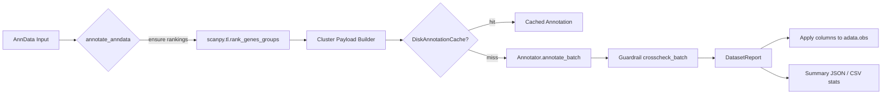

# GPT Cell Annotator × Scanpy Architecture & Roadmap

This document inventories the current Scanpy/AnnData workflow, captures constraints, and stages the upcoming refactor that narrows scope while adding the reliability features requested in the revised mega-plan.

## Current Implementation Snapshot

### Annotate Pipeline (Python API)
- Entry point is the synchronous `annotate_anndata` (`gpt_cell_annotator/scanpy.py`); it handles rank gene computation and chunked batching inline.
- Cluster payloads flow through `_chunk` sized batches (`BatchOptions(chunk_size=...)`):
  - Each chunk checks a `DiskAnnotationCache` before invoking `backend.llm.annotator.Annotator`.
  - Cache misses trigger `annotator.annotate_batch`; results are written back to disk synchronously.
- Marker databases are served via `MarkerDatabaseCache`, which resolves paths, caches them on disk (`~/.cache/gpt-cell-annotator`), and mirrors them in-memory keyed by mtime.
- `_build_annotations` + `_guardrail_settings` feed annotations into `backend.validation.crosscheck.crosscheck_batch`, producing a `DatasetReport` that is wrapped in `ScanpyDatasetReport` with cache/guardrail/offline metadata and logging hooks.
- `_apply_annotations_to_obs` writes results into `adata.obs` (`gptca_label`, `gptca_proposed_label`, `gptca_status`, etc.) and mirrors structured metadata for downstream consumption.

### CLI Surface
- `python -m gpt_cell_annotator.scanpy` exposes a single `annotate` subcommand that can optionally run guardrail-only validation via `--validate-only`.
- CLI flags cover AnnData IO, species presets, offline toggles, chunk size, caching (`--cache-dir`/`--use-cache`), and JSON/CSV report outputs.
- `gpt_cell_annotator/cli.py` registers the command via the top-level `gca` CLI (`gca scanpy ...`), materialising bundled assets before delegating.
- Logging relies on the stdlib logger (`scanpy.annotate.*`, `scanpy.validate.*`) with optional request IDs; telemetry extras are now opt-in via the `observability` extra.

### Test Coverage
- `tests/test_scanpy_integration.py` covers:
- CLI annotate / `--validate-only` round-trips (ensuring `--offline`, JSON report behaviour).
- Disk cache hit reduction, guardrail configuration overrides, helper wrappers (`annotate_from_markers`, `annotate_rank_genes`).
- Fixtures construct synthetic AnnData objects and stub the marker DB loader to avoid network/disk dependencies.

## System Diagram

## Constraints & Compatibility

| Component | Current baseline | Proposed target | Notes |
| --- | --- | --- | --- |
| Python | `^3.11` (pyproject) | 3.9 – 3.12 matrix | Requires tox/nox orchestration and dependency pin audits. |
| AnnData | `^0.10.7` (direct dependency) | ≥0.9 (LTS) & latest minor | Back-compat verification for `.uns["rank_genes_groups"]` structure. |
| Scanpy | Optional `^1.10.1` extra | ≥1.9 track + latest | Loom IO + rank genes API need smoke tests across versions. |
| Backend services | Existing schema (`schemas/annotation.py`) | Unchanged | Telemetry hooks to remain optional extras. |

### Marker DB Asset Requirements

| Asset | Source / materialisation | Default location | Overrides |
| --- | --- | --- | --- |
| `marker_db.parquet` | `assets.ensure_marker_database` (downloads or bundled) | `settings.data_dir / marker_db.parquet` | `GCA_MARKER_DB_PATH` env var or CLI `--marker-db` |
| Marker cache | `MarkerDatabaseCache` (memory + on-disk Parquet mirror) | `~/.cache/gpt-cell-annotator/marker-db` | `GCA_CACHE_DIR` to relocate shared cache. |
| Annotation cache | `DiskAnnotationCache` (JSON files) | `cache_dir` supplied by caller or `~/.cache/gpt-cell-annotator/annotations` | `GCA_CACHE_DIR` + CLI `--cache-dir`. |
| Assets home | `assets.ensure_all_assets` | `~/.cache/gpt-cell-annotator` | `GPT_CELL_ANNOTATOR_ASSETS_HOME`, CLI `--assets-home`. |

## Adjusted Scope Summary

- **Removed (de-scoped)**: asynchronous annotate entrypoint, concurrency-based batching, default structlog/Prometheus wiring, standalone `gca scanpy validate` command.
- **Added (new focus)**: chunk-size batching, persistent marker DB cache, `ScanpyDatasetReport` wrapper, offline-mode reporting, CLI `--validate-only` flag, benchmark + migration docs.

## Phased Roadmap

### Phase 1 — Packaging & Compatibility
- Establish tox/nox matrix (Py3.9–3.12 × AnnData/Scanpy LTS/latest).
- Restructure extras (`scanpy`, `ui`, `dev`, optional `observability`) with lean defaults.
- Document compatibility guarantees, release checklist, and artifact smoke-tests.

### Phase 2 — Core API & Offline
- Refactor `annotate_anndata` to stay synchronous with internal batching (chunked threads) and relocate caching utilities to `gpt_cell_annotator/cache.py`.
- Enforce guardrail threshold configuration surface (no hidden structlog dependency).
- Introduce offline heuristic fallback in the returned `DatasetReport` and cache hit telemetry.

### Phase 3 — CLI, Docs, Benchmarking
- Collapse `validate` behaviour into `annotate --validate-only`.
- Expand CLI flags (`--chunk-size`, `--offline`, `--json-report`, `--species` presets) and integrate JSON schema output.
- Deliver updated docs (`docs/scanpy_integration.md`, migration guide) and performance benchmark notebook (50k synthetic cells, cached vs uncached).

### Phase 4 — Optional Telemetry & Dashboards
- Reintroduce observability behind an `observability` extra (structlog/Prometheus opt-in).
- Explore Streamlit dashboards / metrics export only if adopted.

## Issue Backlog (Draft Tickets)

### Phase 1
- `[P1-001]` Write Scanpy integration architecture doc & compatibility matrix (this prompt).
- `[P1-002]` Add tox matrix + `make packaging-check`.
- `[P1-003]` Update `RELEASING.md` with Python package checklist.

### Phase 2
- `[P2-001]` Refactor `annotate_anndata` batching to synchronous chunks + cache module.
- `[P2-002]` Implement offline heuristic fallback & typed `DatasetReport` wrapper.
- `[P2-003]` Expand integration tests for caching/offline/guardrail thresholds.

### Phase 3
- `[P3-001]` Merge `validate` into `annotate --validate-only` and update CLI help/tests.
- `[P3-002]` Produce benchmark notebook + doc updates + migration guide.
- `[P3-003]` Update CI workflow to run offline CLI smoke + nbmake benchmark.

### Phase 4
- `[P4-001]` Package observability extras and optional telemetry wiring.
- `[P4-002]` Prototype dashboard / metrics publishing (stretch).
