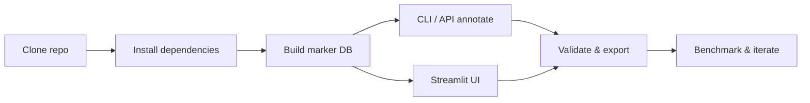

# Getting Started with GPT Cell Annotator

Welcome! This guide takes you from cloning the repository to annotating your first dataset, running the UI, and validating the system end-to-end.



## 1. Prerequisites

- Python 3.11
- Poetry **or** `pip` + virtualenv
- Optional tools: Docker, Redis (for caching), Scanpy (for notebook integration)

## 2. Environment Setup

```bash
# Clone the repository
git clone https://github.com/jameshyojaelee/CellAnnot-GPT.git
cd CellAnnot-GPT

# Option A: Poetry (recommended)
poetry install

# Option B: venv + pip
python3 -m venv .venv
source .venv/bin/activate
pip install -r requirements.txt

# Copy environment template and add secrets (OPENAI_API_KEY optional)
cp .env.template .env
```

### Reproducible bootstrap

```bash
./scripts/setup_env.sh  # Creates .venv, installs dependencies, pins Poetry env
./scripts/run_tests.sh  # Sanity-check install; ensures PYTHONPATH isolation
```

On shared clusters, keep `PYTHONPATH` unset so the project relies solely on the virtual environment.

## 3. Quick Demo (CLI)

```bash
# Build the bundled marker knowledge base without network access
gca build-db --offline

# Annotate demo PBMC markers and save a JSON summary
gca annotate data/demo/pbmc_markers.csv \
  --species "Homo sapiens" \
  --offline \
  --out-json demo_annotations.json
```

Expected output (truncated):

```
Cluster  Primary Label     Confidence  Status     Warnings
0        B cell            High        supported  -
5        Unknown or Novel  Low         flagged    low_marker_overlap
```

`demo_annotations.json` follows the same schema as the REST API and includes validation notes for each cluster.

## 4. Guided Tutorials

### 4.1 Streamlit UI walkthrough

1. Build the marker database (if you skipped the CLI demo):  
   `poetry run gca build-db --offline`
2. Start the API:  
   `poetry run gca api --offline --port 8000`
3. Launch the UI:  
   `poetry run streamlit run frontend/streamlit_app.py`
4. Visit `http://localhost:8501`, upload `data/demo/pbmc_markers.csv`, set species to **Homo sapiens**, and run *Batch Annotate*.
5. Review supported vs flagged clusters; download the JSON report for archival.

Refer to [`docs/demo.md`](docs/demo.md) for a narrated script you can follow during live demos.

### 4.2 Notebook & Scanpy integration

```python
import scanpy as sc
from gpt_cell_annotator import BatchOptions, annotate_anndata

adata = sc.read_h5ad("path/to/your_dataset.h5ad")
result = annotate_anndata(
    adata,
    cluster_key="leiden",
    species="Homo sapiens",
    tissue="Peripheral blood",
    batch_options=BatchOptions(chunk_size=24),
)

result.report.summary
result.adata.obs[["gptca_label", "gptca_status"]].value_counts()
```

See the deep dive in [`docs/scanpy_integration.md`](docs/scanpy_integration.md#annotate-within-a-notebook) for advanced options (custom prefixes, ortholog mapping, CLI equivalents).

### 4.3 API smoke test

```bash
# Backfill the marker database if needed
poetry run gca build-db --offline

# Launch the FastAPI server
poetry run gca api --host 0.0.0.0 --port 8000

# In a second terminal, call the API
curl -s http://127.0.0.1:8000/health
cat > /tmp/payload.json <<'JSON'
{
  "clusters": [
    {"cluster_id": "0", "markers": ["MS4A1", "CD79A", "CD74"]},
    {"cluster_id": "1", "markers": ["CD3E", "CD2", "LCK"]}
  ],
  "dataset_context": {"species": "Homo sapiens", "tissue": "Peripheral blood"}
}
JSON

curl -s -X POST http://127.0.0.1:8000/annotate_batch \
  -H "Content-Type: application/json" \
  -d @/tmp/payload.json
```

API responses match the JSON file emitted by the CLI and notebook helpers.

## 5. Validate Your Setup

```bash
./scripts/run_tests.sh                    # Runs pytest + lint helpers
poetry run pytest tests/test_cli.py       # CLI smoke tests (offline)
poetry run python scripts/run_benchmarks.py --mock --datasets pbmc_small
```

All tasks rely on the same cached assets populated by `gca build-db`.

## 6. Know Your Inputs & Outputs

- **Marker sources** – defined in `config/marker_sources.yaml`; default entries point to the demo CSV/JSON assets in `gpt_cell_annotator/_assets/data/`.
- **Cluster markers** – supply a CSV in the format used by `data/demo/pbmc_markers.csv` or directly from Scanpy ranking results.
- **Outputs** – CSV/JSON summaries, annotated AnnData objects, and validation logs (`structlog` JSON) for tracing.

Adjust validation guardrails (`VALIDATION_MIN_MARKER_OVERLAP`, `CONFIDENCE_OVERLAP_*`) and retrieval settings (`RAG_ENABLED`, `RAG_TOP_K`) before launching the API or CLI as described in [`docs/operations.md`](docs/operations.md#validation-guardrails).

## 7. Troubleshooting

| Symptom | Fix |
| --- | --- |
| CLI reports “marker_db.parquet not found” | Re-run `gca build-db` or set `GPT_CELL_ANNOTATOR_DATA_DIR` to an existing cache. |
| UI stays in mock mode despite API key | Ensure `OPENAI_API_KEY` is exported **before** starting the API/UI processes. |
| Notebook raises `ImportError: scanpy` | Install the extra: `pip install "gpt-cell-annotator[scanpy]"`. |
| Validation flags all clusters as unknown | Review marker overlap thresholds in `.env`; use `--summary-json` to inspect warnings. |

## 8. Next Steps

- Benchmarks: [`docs/benchmarks.md`](docs/benchmarks.md)
- Operations & logging: [`docs/operations.md`](docs/operations.md)
- FAQ & troubleshooting: [`docs/faq.md`](docs/faq.md)
- Rationale & roadmap: [`docs/why.md`](docs/why.md), [`docs/roadmap.md`](docs/roadmap.md)

Happy annotating!
